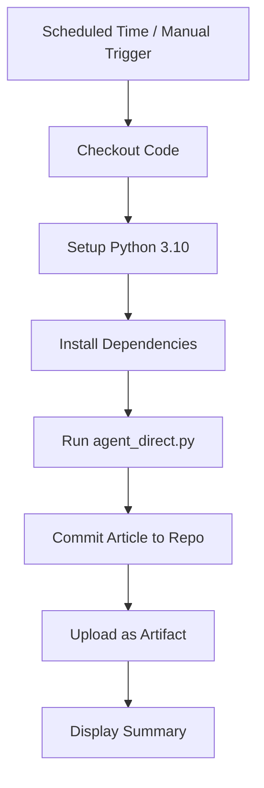

# Deploying to GitHub Actions

This guide explains how to deploy the YouTube Article Agent to run automatically on GitHub Actions - completely free, with built-in logging and no server maintenance needed.

## Why GitHub Actions?

- **Free**: 2,000 minutes/month for free on public repos, 2,000 minutes/month on private repos
- **Scheduled Execution**: Built-in cron scheduling
- **Built-in Logging**: All logs automatically captured
- **Version Control**: All outputs tracked in git history
- **Zero Maintenance**: No servers to manage
- **Perfect for this use case**: Low compute, scheduled tasks

## Cost Breakdown

- **GitHub Actions**: $0 (within free tier - ~3 minutes per run = ~90 minutes/month for daily runs)
- **YouTube API**: $0 (within free tier)
- **Claude API**: ~$0.03 per article
- **Total**: ~$0.90/month for daily articles

## Setup Instructions

### Step 1: Create GitHub Repository

1. Go to https://github.com/new
2. Create a new repository (can be public or private)
3. Name it: `youtube-article-agent` (or your preference)
4. Don't initialize with README (we already have files)

### Step 2: Push Your Code to GitHub

Open your terminal in the project directory and run:

```bash
cd "C:\Claude Agent SDK\youtube-article-agent"

# Initialize git (if not already done)
git init

# Add all files (.gitignore protects .env)
git add .

# Make first commit
git commit -m "Initial commit: YouTube Article Agent"

# Add your GitHub repository as remote
git remote add origin https://github.com/YOUR_USERNAME/youtube-article-agent.git

# Push to GitHub
git branch -M main
git push -u origin main
```

**IMPORTANT**: The `.gitignore` file will prevent your `.env` file (with API keys) from being committed. This is critical for security!

### Step 3: Add GitHub Secrets

Secrets are encrypted environment variables that GitHub Actions can access securely.

1. Go to your repository on GitHub
2. Click **Settings** tab
3. In left sidebar, click **Secrets and variables** → **Actions**
4. Click **New repository secret**

Add these two secrets:

#### Secret 1: YOUTUBE_API_KEY
- **Name**: `YOUTUBE_API_KEY`
- **Value**: Your YouTube Data API v3 key
- Click **Add secret**

#### Secret 2: ANTHROPIC_API_KEY
- **Name**: `ANTHROPIC_API_KEY`
- **Value**: Your Anthropic API key (starts with `sk-ant-api03-...`)
- Click **Add secret**

**Security Note**: Secrets are encrypted and never exposed in logs. Perfect for API keys!

### Step 4: Configure the Schedule

The workflow is set to run **daily at 9 AM UTC** by default.

To change the schedule, edit `.github/workflows/generate-article.yml`:

```yaml
schedule:
  - cron: '0 9 * * *'  # Daily at 9 AM UTC
```

#### Common Schedules:

```yaml
# Every day at 9 AM UTC
- cron: '0 9 * * *'

# Every Monday at 8 AM UTC
- cron: '0 8 * * 1'

# Twice daily (9 AM and 9 PM UTC)
- cron: '0 9,21 * * *'

# Every 6 hours
- cron: '0 */6 * * *'

# Every weekday at 9 AM UTC
- cron: '0 9 * * 1-5'
```

**Cron Format**: `minute hour day month day-of-week`

**Time Zone Note**: GitHub Actions uses UTC. Convert your local time to UTC.

### Step 5: Test the Workflow

#### Option A: Manual Trigger (Recommended for Testing)

1. Go to your repository on GitHub
2. Click **Actions** tab
3. Click **Generate YouTube Article** workflow
4. Click **Run workflow** button
5. Optionally override the topic
6. Click **Run workflow**

#### Option B: Wait for Scheduled Run

The workflow will run automatically at the scheduled time.

### Step 6: View Results

#### View Logs
1. Go to **Actions** tab
2. Click on the workflow run
3. Click on the **generate-article** job
4. Expand each step to see detailed logs

#### Download Artifacts
1. In the workflow run page, scroll to **Artifacts** section
2. Download `article-YYYY-MM-DD-HHMM.zip`
3. Contains the article and logs

#### View Committed Files
The workflow automatically commits:
- `output/article.md` - The generated article
- `logs/agent_log.txt` - Execution logs

Check your repository's commit history to see all generated articles over time!

## How the Workflow Works



### What Happens During Each Run:

1. **Checkout**: Gets latest code from repository
2. **Python Setup**: Installs Python 3.10 with pip caching
3. **Dependencies**: Installs from requirements.txt
4. **Run Agent**: Executes agent_direct.py with secrets as environment variables
5. **Commit**: Commits generated article and logs to repository
6. **Artifact**: Uploads article as downloadable artifact (kept for 30 days)
7. **Summary**: Shows word count and completion status

## Monitoring and Notifications

### Email Notifications (Built-in)

GitHub automatically sends email notifications for:
- Failed workflow runs
- Successful runs (if enabled in settings)

To configure:
1. Go to repository **Settings** → **Notifications**
2. Configure your preferences

### View Cost in Logs

The workflow displays a summary after each run:
- Total tokens used
- Cost breakdown
- Video sources

Check the logs in the Actions tab to see these details.

## Troubleshooting

### Workflow Fails with "YOUTUBE_API_KEY not found"

**Problem**: Secret not configured properly

**Solution**:
1. Go to Settings → Secrets and variables → Actions
2. Verify `YOUTUBE_API_KEY` exists
3. Make sure the name matches exactly (case-sensitive)

### Workflow Fails with "quotaExceeded"

**Problem**: YouTube API quota exhausted

**Solution**:
- Wait 24 hours for quota reset
- Reduce execution frequency
- Request quota increase from Google Cloud Console

### No Article Generated

**Problem**: No transcripts found for the topic

**Solution**:
- Choose a topic with more popular videos
- Check logs to see which videos were attempted
- Ensure videos have English captions enabled

### Workflow Takes Too Long / Times Out

**Problem**: Large transcripts or API delays

**Solution**:
- GitHub Actions has 6-hour timeout (plenty for this agent)
- If hitting limits, reduce number of videos processed
- Check logs for which step is taking time

## Advanced Configuration

### Change Output Location

Edit `.github/workflows/generate-article.yml`:

```yaml
- name: Commit and push article
  run: |
    # Save to dated folder instead
    mkdir -p output/$(date +'%Y-%m')
    mv output/article.md output/$(date +'%Y-%m')/article-$(date +'%Y-%m-%d').md
    git add output/
```

### Add Slack/Discord Notifications

Add a notification step at the end of workflow:

```yaml
- name: Notify Slack
  if: success()
  uses: slackapi/slack-github-action@v1
  with:
    webhook-url: ${{ secrets.SLACK_WEBHOOK_URL }}
    payload: |
      {
        "text": "New article generated! Check it out."
      }
```

### Process Multiple Topics

Create a workflow that loops through multiple topics:

```yaml
- name: Run for multiple topics
  run: |
    for topic in "AI trends" "Web3" "Climate tech"; do
      echo "$topic" > topic.txt
      python agent_direct.py
      mv output/article.md "output/article-$(echo $topic | tr ' ' '-').md"
    done
```

### Enable/Disable Auto-Commit

To disable auto-commit (just use artifacts):

Comment out the "Commit and push" step:

```yaml
# - name: Commit and push article
#   run: |
#     ...
```

## Security Best Practices

✅ **DO**:
- Store API keys in GitHub Secrets
- Use `.gitignore` to exclude `.env`
- Review workflow logs for sensitive data before making repo public
- Rotate API keys periodically

❌ **DON'T**:
- Commit API keys to repository
- Share repository access with untrusted parties
- Echo secrets in workflow logs

## GitHub Actions Usage Limits

### Free Tier Limits:
- **Public repos**: Unlimited minutes
- **Private repos**: 2,000 minutes/month

### This Agent's Usage:
- ~3 minutes per run
- Daily execution: ~90 minutes/month
- **Well within free tier!** ✅

### Paid Plans (if needed):
- **Pro**: $4/month for 3,000 minutes
- **Team**: $21/month for 3,000 minutes

## Example: View Your Articles Over Time

Since articles are committed to the repository, you can:

1. **Browse history**: See all articles in git history
2. **Compare changes**: See how articles evolved for similar topics
3. **Track topics**: Review what topics you've covered
4. **Download any version**: Check out any past article

```bash
# View all committed articles
git log --oneline output/article.md

# View a specific article from the past
git show COMMIT_HASH:output/article.md
```

## Migration Path: GitHub Actions → Cloud (Future)

If you need more features later, you can easily migrate to:
- **AWS Lambda**: Serverless function with EventBridge scheduler
- **Google Cloud Run**: Container-based with Cloud Scheduler
- **Heroku**: Simple deployment with scheduler add-on
- **Vercel/Netlify**: Serverless functions with cron jobs

But for most use cases, **GitHub Actions is perfect**! ✅

## Next Steps

1. ✅ Push code to GitHub
2. ✅ Add secrets (API keys)
3. ✅ Test manual trigger
4. ✅ Wait for scheduled run
5. ✅ Review generated articles in repo

## Resources

- [GitHub Actions Documentation](https://docs.github.com/en/actions)
- [Cron Schedule Examples](https://crontab.guru/)
- [GitHub Actions Pricing](https://docs.github.com/en/billing/managing-billing-for-github-actions/about-billing-for-github-actions)

---

**Questions?** Check the logs in GitHub Actions → Your workflow run → Detailed logs

Built with GitHub Actions | Deployed: 2025-10-14
